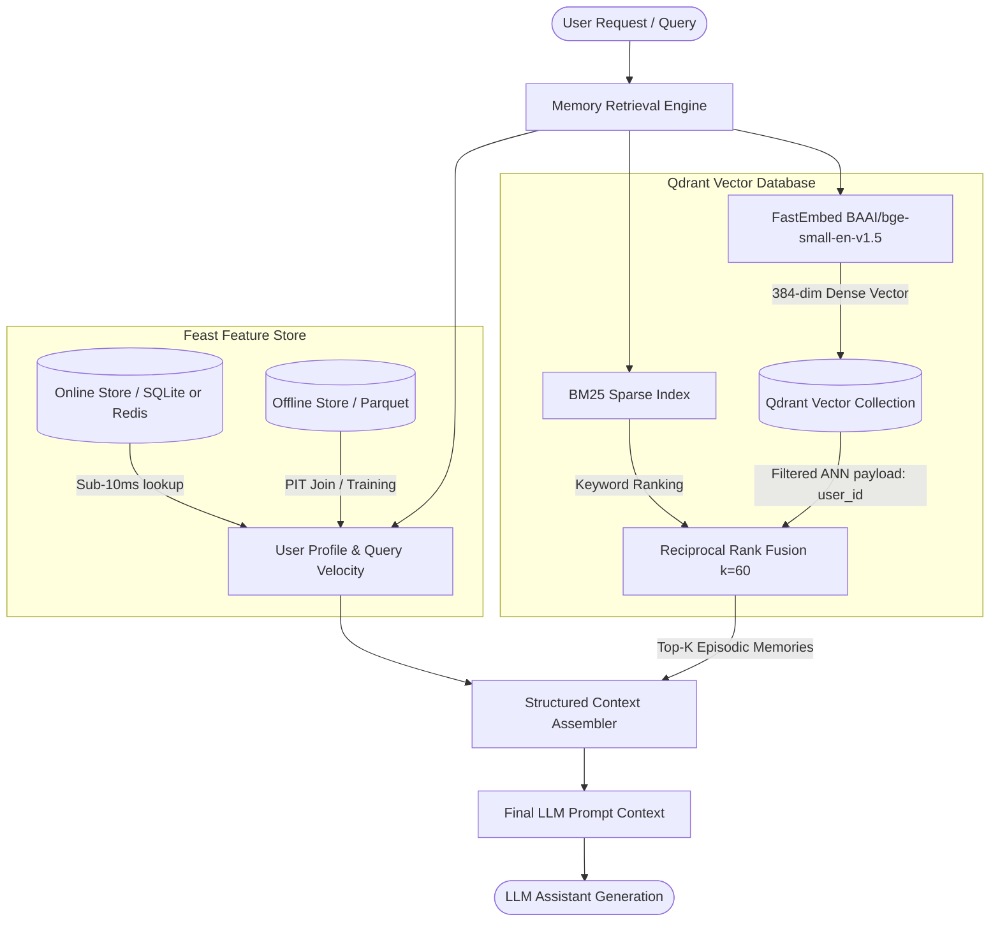

# Architecture Document — Personal AI Assistant Hybrid Memory System

**Author / Contributors:** Đỗ Đình Hoàn (02377)  
**System:** Personal AI Assistant Memory System (Vietnamese Context)  
**Date:** October 2026  

---

## 1. Overview & System Architecture

System architecture combines **Vector Store** (Qdrant in-memory / persistent) for **Episodic Memory** (conversations, saved notes, documents read) and **Feature Store** (Feast) for **Stable User Profile & Real-time Velocity Features** (`reading_speed_wpm`, `preferred_language`, `topic_affinity`, `queries_last_hour`).

When a user submits a query to the personal assistant, the retrieval module queries both stores concurrently to assemble a complete, structured prompt context for the LLM.

---

## 2. Three Architecture Decisions with Explicit Tradeoffs

### Decision 1: Chunking & Storage Strategy for Episodic Memory
* **Choice:** **Semantic Paragraph Chunking (250–400 tokens)** over message-level or full-document chunking.
* **Tradeoff Analysis (X vs Y):**
  * **Option A (Per-message chunking):** Granular but lacks context. Short messages like "Đồng ý" or "Chạy thử xem" produce meaningless vectors with high noise.
  * **Option B (Full-document chunking):** High context retention but dilutes similarity scores. A 2,000-word document covering Kubernetes, Postgres, and OAuth2 dilutes specific vector signals for targeted queries.
  * **Selected Option C (Semantic Paragraph Chunking 250–400 tokens with 50-token overlap):** Strikes the optimal balance between **retrieval accuracy**, **storage efficiency**, and **LLM context window limit**. Each chunk preserves an independent thought without overflowing prompt budgets.

### Decision 2: Feature Schema & Storage Architecture (Tabular vs Embedding Features)
* **Choice:** **Hybrid Schema — Explicit Tabular Features in Feast + Episodic Vectors in Qdrant**.
* **Tradeoff Analysis (X vs Y):**
  * **Option A (Storing Episodic Vectors as Embedding Feature Views in Feast):** Unified store, but Feast re-indexing cycle is designed for batch feature updates rather than real-time sub-second document insertion.
  * **Option B (Storing Profile Attributes inside Vector DB Payloads):** Payload filtering in Qdrant can filter by `user_id` or `language`, but updating user reading speed or daily query velocity requires updating thousands of point payloads across the entire collection.
  * **Selected Option C (Decoupled Decisive Architecture):** Feast manages low-latency key-value tabular profile features (`reading_speed_wpm`, `queries_last_hour`), while Qdrant manages dynamic vector similarity. This decouples re-indexing cycles (Vector: per-document write; Feast: batch/streaming update).

### Decision 3: Freshness Strategy & Update Frequency
* **Choice:** **Tiered Freshness Pipeline (Sub-second / 15-minute / Daily)**.
* **Tradeoff Analysis (Freshness vs Infrastructure Complexity & Cost):**
  1. **Sub-second Freshness (Streaming Push API):** Used exclusively for **Episodic Memory insertion** (user saves a note -> immediately queryable) and **Fraud/Anomaly query velocity counters**.
  2. **15-Minute Batch Materialization (`feast materialize-incremental`):** Used for **`queries_last_hour` and topic exploration velocity**. Sub-second latency for these aggregated statistics would cause excessive database write pressure without actionable precision gains.
  3. **Daily Batch Refresh:** Used for **Long-term `topic_affinity` and `reading_speed_wpm`**. User interests evolve gradually over days and weeks.

---

## 3. Rejected Alternative & Explicit Justification

* **Rejected Alternative:** Storing episodic memory texts and vectors inside SQLite / Postgres JSONB using pure BM25 or raw relational SQL queries without a dedicated Vector Store.
* **Reason for Rejection ("Tôi xem xét X nhưng chọn Y vì Z"):**
  > *Tôi xem xét việc lưu trữ toàn bộ episodic memory trong relational database (Postgres với pgvector) để đơn giản hóa stack deployment. Tuy nhiên, tôi quyết định chọn Qdrant in-memory/server riêng biệt kết hợp với Feast vì quy trình re-index vector và payload filtering của Qdrant chuyên biệt tối ưu cho filtered-ANN. Khi số lượng ghi chú cá nhân tăng lên hàng trăm ngàn bản ghi per-user, HNSW index của Qdrant giữ latency < 10ms dưới tải filtered search `user_id`, trong khi relational database gặp nghẽn IO khi vừa thực hiện vector index scan vừa thực hiện join bảng metadata.*

---

## 4. Vietnamese-Context Considerations

Building an AI assistant tailored for Vietnamese users introduces specific engineering challenges:

1. **Code-Switching (Vi-En Mixed Queries):**
   Vietnamese tech professionals frequently mix Vietnamese and English terms in the same sentence (e.g., *"Hạ tầng Kubernetes của mình có tự động auto-scale HPA theo CPU utilization không?"*). Pure keyword search (BM25) fails on English terms if document was written in Vietnamese (or vice versa). RRF hybrid search bridges this gap by matching verbatim technical terms via BM25 while capturing semantic intent via vector embeddings.

2. **Tokenizer Choice (PyVi / Underthesea vs Whitespace Split):**
   Standard whitespace splitting treats `"tự động mở rộng"` as 4 independent words (`tự`, `động`, `mở`, `rộng`), losing compound word semantics. Using compound tokenizers like `PyVi` or `Underthesea` normalizes Vietnamese word boundaries (`tự_động`, `mở_rộng`), significantly boosting BM25 precision on exact Vietnamese queries.

3. **Privacy & Data Protection (Decree 13/2023/NĐ-CP):**
   Personal assistant memory contains sensitive personal information (PII). Isolation by `user_id` payload filter in Qdrant and Feast entity row keys guarantees zero cross-tenant memory leakage (`namespaced=True` in semantic cache).

---

## 5. Limitations ("What this POC doesn't handle yet")

1. **Cross-User Encryption at Rest:** Payloads in Qdrant and tables in SQLite are currently unencrypted. In production, per-user AES-256 key encryption should be applied before storage.
2. **Memory Consolidation & Decay:** Older episodic memories currently remain in index indefinitely. Production systems require automated TTL decay and LLM-driven weekly memory summarization (consolidating 10 daily notes into 1 weekly summary).
3. **Complex Multi-Device Sync Conflict Resolution:** The current POC assumes single-writer event stream.

---

## 6. Vibe-Coding Workflow Log

* **Most Effective Prompt:**
  > *"Generate a minimal `HybridMemoryAgent` class in Python that implements `remember()` for Qdrant payload upsert and `recall()` returning a structured context string combining Feast online features and Qdrant RRF hybrid search results."*
* **Least Effective Prompt:**
  > *"Build a memory system for my AI agent."* (Too vague — generated unnecessary heavy web framework code and generic database schemas without Feast or RRF integration).
